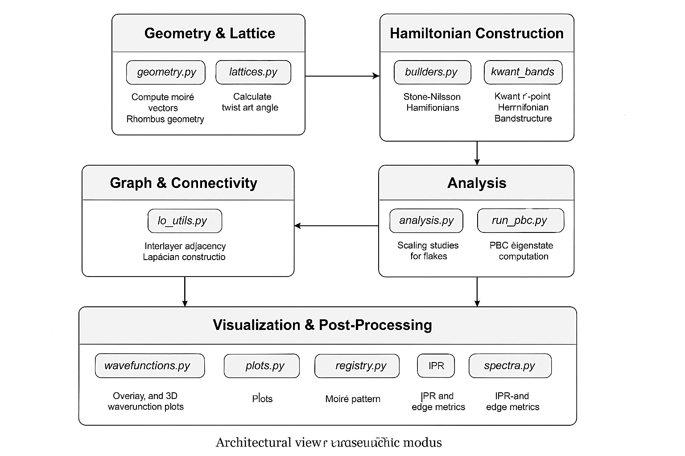

# 📘 py_tblg
### *Python package for simulating electronic structure and registry effects in twisted bilayer graphene (tBLG) and moiré systems*

---

## 🧩 Overview
`py_tblg` is a modular Python framework for generating, analyzing, and visualizing **commensurate and incommensurate twisted bilayer lattices**.  
It enables tight-binding calculations, moiré lattice construction, bandstructure computation, and real-space wavefunction visualization.

The goal is to provide a flexible research tool for exploring **spectral and registry features** in tBLG and related 2D materials

---

## 🧠 Features
- Generation of **commensurate supercells** using integer parameters *(m, r)*
- Construction of **twisted bilayer geometry** from primitive graphene lattice vectors
- Computation of **interlayer coupling** and **hopping energies**
- Support for **spectral calculations** using sparse solvers (`scipy.sparse.linalg`, `kwant`)
- **Edge-state and in-gap-state analysis**
- Visualization tools for:
  - Band structures and density of states
  - Real-space wavefunctions
  - Moiré registry maps and domain walls

---

## 🗂️ Project structure


## 🏗 Architectural Overview

The following diagram illustrates the modular architecture of **py_tblg**:



### Layers:
1. **Geometry & Lattice**: `geometry.py`, `lattices.py`  
2. **Hamiltonian Construction**: `builders.py`, `kwant_bands.py`  
3. **Analysis**: `analysis.py`, `run_pbc.py`  
4. **Graph & Connectivity**: `io_utils.py`  
5. **Visualization & Post-Processing**: `wavefunctions.py`, `plots.py`, `registry.py`, `spectra.py`

---

### 📂 File Responsibilities

| File                | Responsibilities                                      | Key Functions                                      |
|---------------------|--------------------------------------------------------|----------------------------------------------------|
| `geometry.py`       | Moiré vectors, rhombus geometry, twist angle          | `moire_vectors_primitive`, `theta_comm_deg_from_mr` |
| `lattices.py`       | Graphene primitives, Kwant lattice setup              | `graphene_primitives`, `layer_lattices`           |
| `builders.py`       | Sparse Hamiltonians for flakes and PBC                | `build_flake_H_sparse`, `build_approximant_H_sparse_pbc` |
| `kwant_bands.py`    | Kwant-based bandstructure and Γ-point Hamiltonian     | `compute_tblg_bands_kwant`, `build_pbc_H_gamma_from_kwant` |
| `analysis.py`       | Scaling studies, gap analysis                         | `run_gap_scan`                                     |
| `run_pbc.py`        | PBC eigenstate computation, wavefunction saving       | `run_one_approximant`                              |
| `run_pbc_analysis.py`| Graph-theoretic analysis, Laplacian modes            | `compute_graph_metrics`                            |
| `io_utils.py`       | Interlayer adjacency, CSV export                      | `save_interlayer_hoppings_csv`, `build_interlayer_adjacency_from_csv` |
| `wavefunctions.py`  | Wavefunction overlays and 3D plots                    | `save_wavefunction_overlay_registry_png_clean`     |
| `plots.py`          | Heatmaps, lattice plots, interlayer link visualization| `plot_wavefunction_heatmap`, `plot_interlayer_links` |
| `registry.py`       | Moiré registry maps, AA/AB/BA/Walls masks             | `get_registry_grid`, `region_masks_from_phi`       |
| `spectra.py`        | Eigenvalue solvers, IPR, edge metrics                 | `eigs_in_window_sliced`, `ipr`                    |

---

## 🚀 Getting Started

### Installation

Clone the repository and install dependencies:

```bash
git clone https://github.com/yourusername/py_tblg.git
cd py_tblg
pip install -r requirements.txt
